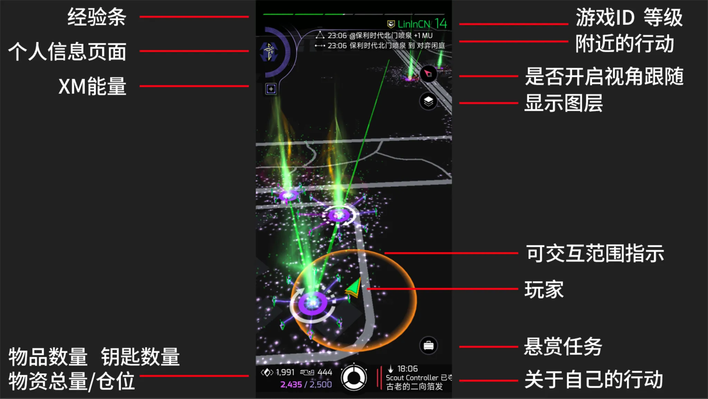
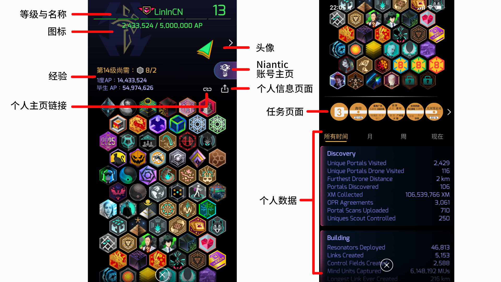
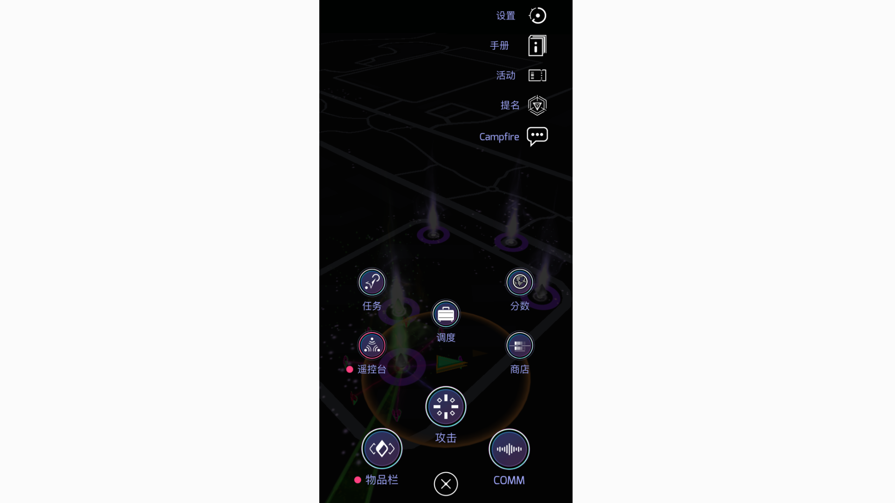

import { Badge } from '@astrojs/starlight/components';

## 游戏主界面

当您打开游戏后，您看到的页面如上图所示，其中标注了四周元素的基本含义。游戏中的地图为真实世界的简化版。

- **经验条**： 经验条显示了您当前等级的经验值（其中间隔并无实际意义）
- **个人信息页面**： 点击后可进入个人主页
- **XM能量**： 各种行动都需要使用XM能量。XM能量可通过能量核补充
- **仓位**：点击此处可进入自己的物品栏

   Ingress的仓位默认为2000，仓位不会随着等级提升改变。您只有以下两种办法增加存储空间：
   1. **充值会员** :

      当您在商店充值会员后，您可以立刻获得500额外仓位。此额外仓位仅在会员生效期间有效。
   2. **购买钥匙箱** :

      在商店中，您可以购买钥匙箱来存放钥匙（key），存入钥匙箱的钥匙将不会计入仓位，即增加了额外的存储空间。
      您总共可以购买5个钥匙箱，每个钥匙箱可存放100把钥匙。
- **游戏ID**： 显示您的游戏名称和当前等级
- **附近的行动**： 此处会显示附近玩家（包括自己）产生的行动
- **视角跟随**： 激活后画面将自动根据您所处方位自动旋转
- **显示图层**： 根据不同游戏需求在地图上显示不同的标记
- **可交互指示范围**： 大部分与Portal的交互、行动仅能在黄色范围内
- **悬赏任务**：每日任务页面，依据要求完成任务将获得奖励。特殊活动也将显示在此处
- **关于自己的行动**： 玩家回复、与玩家相关的活动将在此处显示
- **主菜单按钮**：中间最下方圆环为主菜单按钮 ，主菜单按钮页面将在下方 [主菜单按钮](#主菜单按钮)介绍

import { Aside } from '@astrojs/starlight/components';

<Aside>
- 游戏的主色调为绿色或蓝色，这与玩家阵营有关
- 示例图中的 Portal 下有白色环形箭头，这与【扫描能量塔】操作有关
- 示例图中 Portal 之间有绿色连线，这与【连线】操作有关
</Aside>

## 个人主页

当您点击游戏主界面的 `个人信息页面` 后，则来到个人主页，个人主页信息较长，您可以向下翻阅看到更多信息。

- **等级与名称**： 与主页面相同
- **图标**： 点击此处可以更换 `此处` 以及 `游戏主界面左上角` 的图标与背景
- **经验**： 
   - **毕生AP**： 此处标注了从1级到当前级别所有的经验值之和
   - **x度AP**： 特工可以在达到16级满级时进行转生，此处显示了转生次数与当前转生的经验值
   - **第x级尚需**： 此处显示了玩家抵达下一个等级需要的额外徽章要求，详细内容将在【等级系统】中介绍
- **个人主页链接**： 点击后分享，其它特工点击链接将直接出现特工个人主页
- **头像**： 点击后可改变特工在地图上显示的样式，其它特工查看个人主页时也可看到
- **Niantic账号主页**： 游戏制作公司Niantic的个人账号页面（基本无实际用处）
- **个人信息页面**： 点击此处后将复制账号的所有信息，主要用于 IFS（游戏聚会活动）的签到与签退，其它第三方软件（[Agent Stats](https://www.agent-stats.com/)）的个人信息识别
- **任务页面**： 点击后将进入任务页面，查看你完成的所有任务
- **个人数据**： 此处显示了特工的其它活动数据

## Portal 页面

与 Portal 交互是游戏的核心玩法，故此部分内容在 [[InteractWithPortal]] 页面另述。

## 主菜单按钮

当点击主页面最下方的环形按钮后，则会看到上图页面，其中大部分按钮的操作将在[[InteractWithPortal]]详细介绍。