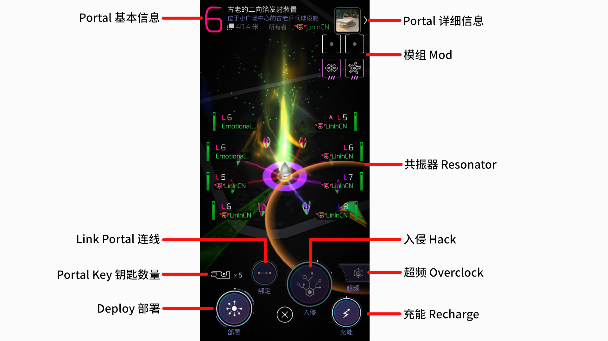

Portal 是游戏中最核心的元素之一，与 Portal 交互是游戏的核心玩法。几乎所有的游戏活动都与 Portal 有关，特工们一般将 Portal 简称为 po 。通过占领更多的 po 、连线画三角覆盖更多区域以扩大己方势力范围是游戏的核心玩法。

**当前地图中存在四种颜色的 Portal  ：**

- 蓝色 Portal ：由蓝军占领的 Portal
- 绿色 Portal ：由绿军占领的 Portal
- 白色 Portal ：未被占领的 Portal
- 红色 Portal ：自动生成的人机 Portal

# 识别Portal交互页面

当您点击

# Portal的基本信息

# 部署

# 连接 Link

**为什么要连线：**

- 对于游戏对战来说，由于连线不可相交，当射出一条足够长的线时，我们能够阻止敌方特工在此区域进行连线行为
- 对于游戏对战来说，当通过连线构成三角形控制区域（Field）时，覆盖域内将呈现我方颜色，在区域内部，敌军将无法形成自己的域，连线距离也受到限制
- ✅ 连线可以获得AP
- 🔷 连线将增加【徽章 Connector】 计数
- 🔷 建立域将增加【徽章 Mind Controller】 计数

**当满足以下要求时，可以向另一个 Portal 射出连线：**

- 当前 Portal 已部署满8个脚位
- 此 Portal 与被射入 Portal 的距离在此 Portal 的射程之内（射程与脚等级、Mod有关）
- 持有被射 Portal 的 Key，在连线成功后，被射入 Portal 的 Key 将被消耗
- 此 Portal 与被射 Portal 之间没有其他连线阻隔

✅ 当您成功进行一次连线，您将获得 313AP

> 对于一些距离较远的 po ，ingress 并不会实时计算能否连线，在点击「连接」后才会运算，并显示无法连接，这是正常的

## 关于建立控制区域（Control Fied）与多重

当三个Portal 彼此连接后，被覆盖区域将呈现特工方的颜色，此即为建立控制区域。

**建立控制区域的目的：**

- 控制区域的产生将进一步限制敌方的连线，是一种战略行为
- ✅ 建立控制区域能获得 1250AP，这是游戏中快速获得经验的方式之一
- 🔷 建立域将增加徽章 【Mind Controller】 计数
- 🔷 建立域的大小将增加徽章 【Illuminator】 计数

建立控制区域是一种非常高效的获取经验的方式，当我们建立一个控制区域时，需要连接3条线，合计将获得 ✅ 2189AP。

**连多重：**

另外，系统在计算经验获取时，是根据是否建立了一个三角形来计算的。但三角形是可以重合的。例如下图情况：

因此，我们可以通过此特性，高效的利用有限的空间，在有限空间内尽可能建立多个三角形，以达到高效升级的效果。以下是一个比较常见的建立多重的方式：

除了「固定底边-寻找顶点」这种方式以外，我们也可以通过「固定顶点-向定点回射」的方式降低思考成本，更快速的建立多个三角：

当然，是否建立多重，以何种方式建立，都没有绝对的对或错。如果特工时间比较紧张，那么胡连一通也无伤大雅，如果有充足的时间和脑力，尽可能构建多重自然是性价比最高的方案。

> **一些常见的名词：** 胡连：不管不顾的乱连线

# 入侵（Hack）

入侵是一种获取物资的行为，您可以入侵任意颜色的 Portal 以获取物资。点击 Hack 按钮即可进行最简易的 Hack。而当您长按 Hack 按钮时，上方会显示三个按钮，从左到右依次为：

- 画图 Hack：通过画图这一投入获得更多物资
- 请求钥匙 Hack：希望获得钥匙
- 请求无钥匙 Hack：希望以不获得钥匙的方式获得更多物资

一般来说，画图 Hack 是特工们常用的获取物资方式，新手也应尽快熟悉画图Hack的基本操作。画图过程分为三个阶段：

- 准备时间：此时会显示画图页面，但图案并未出现，此时特工可以通过画多种指令的方式达到不同效果。
- 图案显示：依次显示图案
- 画图时间：在全点高亮后，进入倒计时，特工在有限时间内按照图案显示顺序画出图案

**画图的目的：**

- ✅ 根据画图数量和画图快慢获得经验
- 🔷 画图将获得徽章 Translator 计数
  - 3 图全对 +4 计数
  - 4 图全对 +8 计数
  - 5 图全对 +15 计数
  - 若没有全对，则不增加计数

**另外，画图数量与po的等级、特工等级有关：**

- 1-3级特工最多可画3图，1-5级po可画3图
- 1-5级特工最多可画3图，1-5级po可画3图
- 6-7级特工最多可画4图，6-7级po可画4图
- 8级特工最多可画8图，8级po可画5图

## 通过无人机入侵

# 充能

# 攻击

# 添加Mod

您可以为己方的 Portal 添加 Mod，以此来为 Portal 增加额外能力。每个 Portal 有4个Mod槽位，每个特工最多只能添加2个Mod。

## 模组类型

**模组主要有以下类型：**

- 散热模组：减少 Hack 间隔时间（安装散热模组后，冷却时间将立刻刷新）
- 多次入侵模组：增加 Portal 入侵次数
- 盾：抵御敌方攻击
- 长连线模组：增加连线相关的指数
- 傅立叶：改善 Hack 后 获得的物资类型

- 对于能量塔护盾Mod的使用

  在我们游玩的过程中，何时使用盾会比较合适呢？

  对于普通的绿色能量塔护盾，它本身的防御力很低，如果对方使用8炸进行攻击，绿盾几乎不会产生防御效果。因此绿盾适合放在野生的po上，或者是在po场刷分时，时可以随意使用绿盾

  而对于紫色护盾，已经可以对8炸产生不错的抵抗力。因此适合放置在您需要防御攻击的重要portal上。

  要注意的是，虽然宙斯神盾是一个非常强有力的防御Mod，但它出现概率极低，请谨慎使用

- 安装Mod的条件
  - 必须是己方Portal，即至少要部署一个共振器（脚）
  - 需要消耗一定的XMA能量

# 扫描能量塔 Scan Portal

**您需要达到8级才可以使用此功能**

Scan Portal 简称【扫po】，您可以在 点击 Portal-点击右上角图片-中下位置看到 Scan Portal 标志

扫po 是一个类似于3D建模的过程，通过您的摄像头对现实中的po进行多次扫描，以在服务器中构建该Portal的3D建模。当建模成功后，当看到Portal上有形似银色种子的存在，即可以进行 Overclock。具体流程如下

1. 点击 Portal 右上角，找到【扫描能量塔】按钮，开始扫po，每次扫po至少需要15s才可上传。
2. 在 [https://lightship.dev/](https://lightship.dev/) 注册账号，进入 【Geospatial Browser】页面，找到扫描的 Portal，查看扫po次数与时间要求，根据要求达到扫po次数，直到【Active】按钮可点击
3. 在薛定谔的时间点击【Active】，在薛定谔的时间出现成功激活标识，并等待服务器生成3D建模
4. 关注网站与地图，如果生成建模精度不高，则地图上不会出现【银色种子】，需要再进行未知次数的扫po，未知次数的【Active】，直到成功。

✅ 上传扫po数据成功后，您可以获得500AP的经验，并对扫po相关徽章进行计数，每天最多可扫描500次，次日恢复扫po限额。

🔷 扫描许久没有被扫的po可以成为「Scout Controller」，对相关徽章进行计数。

⚠️请各位特工注意周边环境，在敏感地区谨慎使用此功能，避免被误解造成不必要的麻烦

⚠️注意：并不是所有的设备都支持 Scan Portal 功能，如果您的游戏中没有扫po按钮，您可以尝试以下方案：

- 在Google Play中找到 紫色图标的 Google AR 并下载
- 尝试为你的手机刷机，更换国际版或原生系统

# 超频 Overclock

超频（OverClock） 是游戏中一种特殊的画图方式

**为什么要超频呢？**

- 超频画图可以以2倍效率或4倍效率获取经验、物资、牌子计数

## 超频条件

**需要达成以下条件才可以进行超频：**

- 手机系统与硬件支持
- 该 Portal 已激活 超频 功能
- 位于可超频 Portal 20m 内

当达成条件时，超频按钮将亮起，Portal 上将升起立方体

## 超频流程

**超频过程如下：**

1. 点击超频按钮
2. 摄像头对准 Portal 进行横移或旋转扫描，使此刻画面尽可能与3D建模内容吻合
3. 根据吻合程度，将出现【超频倍数X2】或【超频倍数X4】，次数字意味着1次画图顶2次或4次
4. 出现画图页面，此处可以画【获取钥匙】指令以增加钥匙出现可能性
5. 出现立方体结构，特工可围绕立方体旋转，以识别正确的图案，识别后点击最下方按钮，开始画图1
6. 图1画完后，点击确认会出现下一个立方体，按照步骤3继续识别并画出剩下的图案
7. 画图结束，出现结算页面

# 改善这个能量塔

